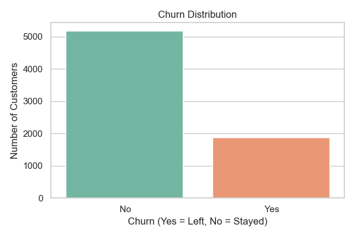

# Customer Churn Predictor

A machine learning project that predicts whether a telecom customer will churn (leave the service), built with Python, Scikit-learn, and Streamlit.

---

## Live Demo

Run the app locally and enter any customer's details to get an instant churn prediction with risk percentage.



---

## Project Structure

```
churn-predictor/
├── data/                        # Raw dataset and saved charts
├── models/                      # Trained model and scaler (.pkl files)
├── notebooks/
│   ├── 01_eda.ipynb             # Exploratory Data Analysis
│   ├── 02_data_prep.ipynb       # Data Cleaning & Feature Engineering
│   └── 03_model_training.ipynb  # Model Training & Evaluation
├── src/
│   └── app.py                   # Streamlit web app
├── requirements.txt
└── README.md
```

---

## What This Project Does

1. **EDA** — Explored churn patterns by contract type, monthly charges, and tenure
2. **Data Prep** — Fixed missing values, encoded categorical columns, scaled features
3. **Model Training** — Trained Logistic Regression and Random Forest; compared accuracy, precision, recall, and F1
4. **Web App** — Built an interactive Streamlit app where you input customer details and get a live churn prediction

---

## Model Performance

| Model               | Accuracy |
|---------------------|----------|
| Logistic Regression | ~80%     |
| Random Forest       | ~82%     |

> Random Forest was selected as the final model due to higher overall performance and better recall on churned customers.

---

## Key Insights

- Customers on **month-to-month contracts** churn the most
- **Higher monthly charges** strongly correlate with churn
- Customers with **longer tenure** are much less likely to churn
- **Fiber optic** internet users churn more than DSL users

---

## Tech Stack

| Tool | Purpose |
|------|---------|
| Python | Core language |
| Pandas & NumPy | Data manipulation |
| Scikit-learn | ML models and preprocessing |
| Matplotlib & Seaborn | Data visualization |
| Streamlit | Web app UI |
| Pickle | Model serialization |

---

## How to Run

```bash
# 1. Clone the repo
git clone https://github.com/YOUR_USERNAME/churn-predictor.git
cd churn-predictor

# 2. Create and activate virtual environment
python -m venv venv
venv\Scripts\activate        # Windows
source venv/bin/activate     # Mac/Linux

# 3. Install dependencies
pip install -r requirements.txt

# 4. Run the app
streamlit run src/app.py
```

---

## Dataset

[Telco Customer Churn — IBM Sample Dataset via Kaggle](https://www.kaggle.com/datasets/blastchar/telco-customer-churn)

---

## Author

**Kishore Mamidi**  
[LinkedIn](https://linkedin.com/in/YOUR_LINKEDIN) • [GitHub](https://github.com/YOUR_USERNAME)
